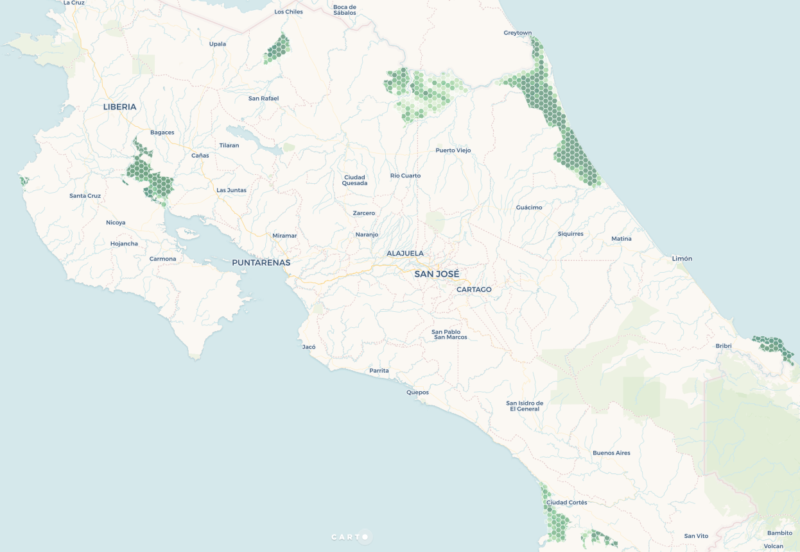

# El Índice de Naturaleza de los sitios Ramsar de Costa Rica

## Introducción

El [Índice de Naturaleza](http://journals.plos.org/plosone/article?id=10.1371/journal.pone.0018930) (Certain et al., 2011) es un marco de trabajo [desarrollado en Noruega](http://www.nina.no/english/Environmental-monitoring/The-Norwegian-Nature-Index), apoyado en tecnología informática, que **permite sintetizar y comunicar el conocimiento acerca del estado de la biodiversidad en áreas geográficas y períodos de tiempo determinados**, a partir de un conjunto de **indicadores**. Estos indicadores son **variables naturales relacionadas con diversos aspectos de la biodiversidad** en el área en estudio como, por ejemplo, la densidad, abundancia o distribución de una especie; métricas taxonómicas, funcionales o genéticas; o parámetros demográficos y de comportamiento.

La implementación del Índice de Naturaleza para los [12 sitios Ramsar de Costa Rica](https://www.ramsar.org/es/humedal/costa-rica) (llamados también **Humedales Protegidos de Importancia Internacional**), ha permitido avanzar en la sistematización de la información que se requiere para conocer el estado de la biodiversidad en estos sitios y así ayudar a mitigar las amenazas a los ecosistemas que los componen. Esta sistematización es uno de los resultados prioritarios del proyecto [“Conservación, Uso Sostenible de la Biodiversidad y Mantenimiento de los Servicios de los Ecosistemas de Humedales Protegidos de Importancia Internacional”](http://www.proyectohumedalescr.info/) (conocido también como Proyecto Humedales), el cual tiene como objetivo apoyar la gestión de los sitios Ramsar de Costa Rica con el fin de aumentar su conservación y uso sostenible, así como el mantenimiento de los servicios ecosistémicos que proporcionan.

Cada indicador es reportado para un total de [2006 hexágonos de 5 km2](https://inhumedalescr.carto.com/builder/d507a6aa-5ae7-441e-b921-ab880fde01e3/embed) en los que han sido divididos los sitios Ramsar de Costa Rica. Esta división está basada en los puntos de muestreo del [Inventario Nacional Forestal](http://www.sirefor.go.cr/?p=1170), lo que permite el intercambio de datos con esta y otras iniciativas a nivel nacional. **Todos los indicadores son normalizados a un valor entre 0 y 1** para cada hexágono, en donde el **0 (rojo en los mapas) representa un mal estado del indicador y el 1 (azul) representa un estado ecológicamente sostenible del indicador** y que minimiza la probabilidad de su extinción (o de la especie o comunidad a la que está relacionado). Al valor numérico correspondiente a este estado ecológicamente sostenible se le denomina **valor de referencia del indicador**.

## Indicadores

La siguiente es la lista de indicadores utilizados en la implementación del Índice de Naturaleza en los sitios Ramsar de Costa Rica:

* [Riqueza de especies de mamíferos terrestres](#riqueza-de-especies-de-mam%C3%ADferos-terrestres)
* [Riqueza de especies de aves acuáticas residentes](#riqueza-de-especies-de-aves-acu%C3%A1ticas-residentes)
* [Extensión de la cobertura vegetal natural y de la cobertura acuática natural](#extensi%C3%B3n-de-la-cobertura-vegetal-natural-y-de-la-cobertura-acu%C3%A1tica-natural)

### Riqueza de especies de mamíferos terrestres

Haga clic en el mapa para verlo en detalle

Este indicador se construyó con base en **2429 registros de presencia** (ej. recolecciones, observaciones) de **96 especies de felinos, ungulados, cánidos, roedores, marsupiales y otros grupos de mamíferos terrestres**. El valor del indicador representa la riqueza (i.e. cantidad) de especies reportadas en cada hexágono, en dónde el valor de referencia para cada sitio Ramsar corresponde al hexágono con la mayor riqueza de especies en cada sitio. Así, los hexágonos con riqueza de especies cercanos a ese máximo tendrán valores próximos a 1 (color azul) y los de menor riqueza tendrán valores cercanos a 0 (color rojo) en cada sitio Ramsar.

Los registros de presencia provienen de una [consulta](https://www.gbif.org/occurrence/download/0001416-171113114016250) al portal de la [Infraestructura Mundial de Información en Biodiversidad (GBIF)](https://www.gbif.org/) y de [datos proporcionados por funcionarios de las áreas de conservación de Costa Rica e investigadores independientes](data/Datos_IN_Mamiferos_terrestres.xlsx).

### Riqueza de especies de aves acuáticas residentes

Haga clic en el mapa para verlo en detalle

Se utilizaron **46643 registros de presencia** de las **175 especies** que integran la lista del [censo de aves acuáticas residentes](http://uniondeornitologos.com/?p=10926) de la [Unión de Ornitólogos de Costa Rica](http://uniondeornitologos.com/). El valor del indicador representa la riqueza (i.e. cantidad) de especies reportadas en cada hexágono, en dónde el valor de referencia para cada sitio Ramsar corresponde al hexágono con la mayor riqueza de especies en cada sitio. Así, los hexágonos con riqueza de especies cercanos a ese máximo tendrán valores próximos a 1 (color azul) y los de menor riqueza tendrán valores cercanos a 0 (color rojo) en cada sitio Ramsar.

Los registros de presencia provienen de dos consultas ([1](https://www.gbif.org/occurrence/download/0005313-171113114016250), [2](https://www.gbif.org/occurrence/download/0005314-171113114016250)) al portal de GBIF y de [datos proporcionados por funcionarios de las áreas de conservación de Costa Rica e investigadores independientes](data/Datos_IN_Aves_acuaticas.xlsx).

### Riqueza de especies de tortugas marinas

Haga clic en el mapa para verlo en detalle

Este indicador se construyó con base en **68 registros de presencia** de **4 especies de tortugas marinas**. El valor del indicador representa la riqueza (i.e. cantidad) de especies reportadas en cada hexágono, en dónde el valor de referencia para cada sitio Ramsar corresponde al hexágono con la mayor riqueza de especies en cada sitio. Así, los hexágonos con riqueza de especies cercanos a ese máximo tendrán valores próximos a 1 (color azul) y los de menor riqueza tendrán valores cercanos a 0 (color rojo) en cada sitio Ramsar.

Los registros de presencia provienen de una [consulta](https://www.gbif.org/occurrence/download/0001073-171124123535762) al portal de la [Infraestructura Mundial de Información en Biodiversidad (GBIF)](https://www.gbif.org/) y de [datos proporcionados por funcionarios de las áreas de conservación de Costa Rica e investigadores independientes](data/Datos_IN_Tortugas_marinas.xlsx).

### Extensión de la cobertura vegetal natural y de la cobertura acuática natural

Haga clic en el mapa para verlo en detalle

Este indicador muestra la extensión de la cobertura vegetal natural y de la cobertura acuática natural en los sitios Ramsar en los que que el Proyecto Humedales ha realizado estudios de cobertura y uso de la tierra. Estos sitios son: **Térraba Sierpe, Gandoca-Manzanillo, Caribe Noreste, Maquenque, Caño Negro y Palo Verde**. Para calcular el indicador, **se le asigna un peso entre 0 y 1 a cada uno de los tipos de cobertura y uso de la tierra** identificados por el Proyecto Humedales, como se muestra en la siguiente tabla:

| Cobertura/uso              | Peso |   | Cobertura/uso                | Peso |
| -------------------------- | ----:| - | ---------------------------- | ----:|
| Cobertura boscosa          | 1    |   | Agricultura                  | 0    |
| Manglar                    | 1    |   | Cultivo de arroz             | 0    |
| Yolillal                   | 1    |   | Cultivo de caña              | 0    |
| Laguna                     | 1    |   | Cultivo de piña              | 0    |
| Red hídrica                | 1    |   | Plantación de banano         | 0    |
| Mar                        | 1    |   | Plantación de palma aceitera | 0    |
| Playas y arenas-sedimentos | 1    |   | Terreno descubierto          | 0    |
| Plantación forestal        | 0.7  |   | Estanque de acuicultura      | 0    |
| Charral                    | 0.5  |   | Zona urbana descontinua      | 0    |
| Pastos                     | 0.01 |   | Red vial                     | 0    |
|                            |      |   | Área de nubes                | 0    |
|                            |      |   | Área de sombras              | 0    |

**Los tipos de cobertura que son naturales tienen un peso de uno y este peso disminuye conforme aumenta el grado de intervención humana en la cobertura o el uso**. Para cada hexágono, el valor del indicador se calcula sumando las áreas de cada tipo de cobertura/uso multiplicadas por el peso respectivo y diviendo esta suma entre el área total del hexágono, como se muestra en la siguiente fórmula:

**_(area_tipo1 * peso_tipo1 + area_tipo2 * peso_tipo2 + ... + area_tipoN * peso_tipoN) / area_hexagono_**

Entonces, el resultado final para cada hexágono es un valor entre 0 y 1 en donde **los valores cercanos a 1 reflejan un predominio de los tipos de coberturas de vegetación natural y los cercanos a 0 reflejan predominio de tipos intervenidos por el ser humano**.

## Bibliografía

Certain, G., Skarpaas, O., Bjerke, J. W., Framstad, E., Lindholm, M., Nilsen, J. E., … Nybø, S. (2011). The nature index: A general framework for synthesizing knowledge on the state of biodiversity. PLoS ONE, 6(4). https://doi.org/10.1371/journal.pone.0018930
